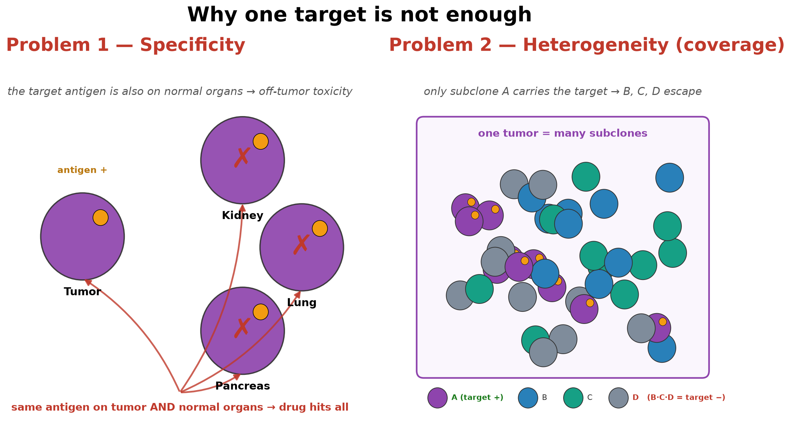
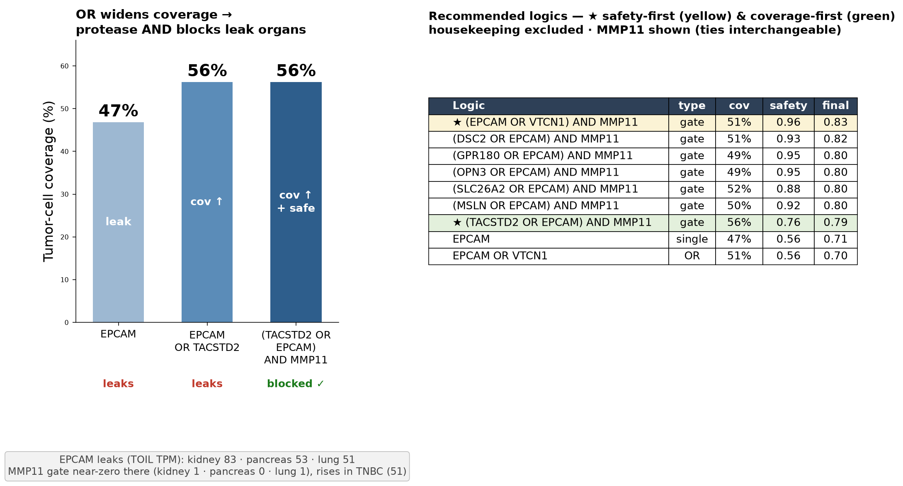
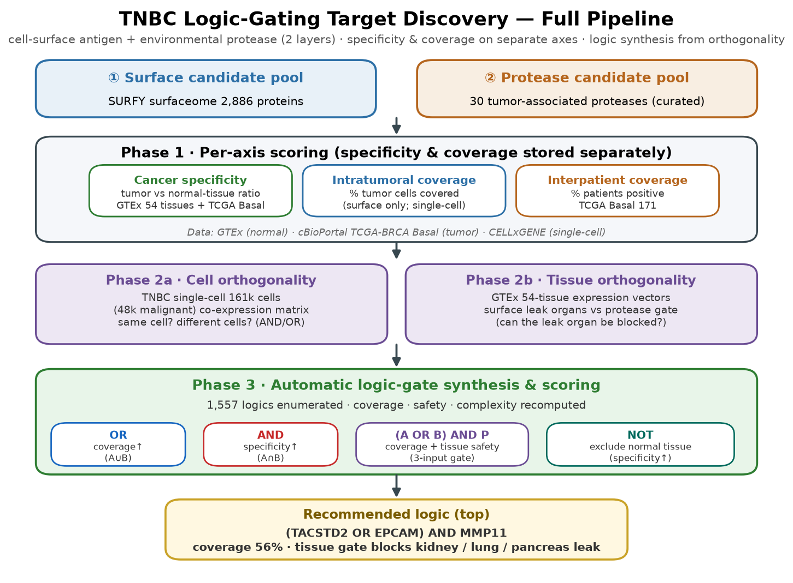
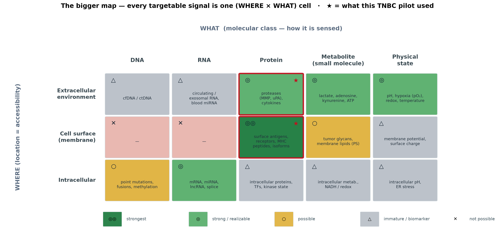

# Programmable Medicine — Target Discriminator Atlas

**A logic-gating target-discovery pipeline for triple-negative breast cancer (TNBC).**

Cancer therapy faces two problems that a single target rarely solves at once:

1. **Specificity** — hit the tumor, spare normal organs.
2. **Coverage** — reach a heterogeneous tumor whose subclones express different antigens.

This pilot scores cell-surface proteins and extracellular proteases on independent axes,
then composes them into 2–3-input Boolean logic gates — `(A OR B) AND protease` — that
widen tumor coverage with an OR while a protease AND restores organ specificity.



---

## Headline result

The recommended discriminator for TNBC is:

> **(EPCAM OR VTCN1) AND MMP11** — coverage 0.51, safety 0.96, final score 0.83

- The **OR** of two surface antigens lifts malignant-cell coverage from 47% (EPCAM alone) to ~51–56%.
- The **AND MMP11** protease gate is near-zero in the organs EPCAM leaks into
  (kidney, pancreas, lung) yet high in TNBC — blocking off-tumor toxicity.

This logic is **modality-independent**: the same `(A OR B) AND protease` rule can be built as a
logic-gated CAR-T cell, or as a pro-antibody molecule that only becomes active when both surface
antigens and the protease are present.



---

## Pipeline



| Stage | Data | Function | Output |
|---|---|---|---|
| ① Candidate pools | SURFY surfaceome (2,886) + literature proteases (30) | curate + classify | 2,886 surface / 30 protease |
| ② Per-axis scoring | TCGA Basal 171 · GTEx 54 tissues · TME + inhibitors | `rank(tumor)×rank(1−tox)`; protease `expr×(1−inhibitor)` | specificity score + activity proxy |
| ③ Coverage & orthogonality | TCGA (interpatient) · CELLxGENE (single-cell) · GTEx TOIL | % patients >100 TPM; % malignant cells; co-expression + leak tissues | intra/inter coverage + cell/tissue orthogonality |
| ④ Logic synthesis | all matrices from ①–③ | drop housekeeping proteases; enumerate `(A OR B) AND protease`; score | ranked logic gates |

---

## Repository layout

```
├── report/     detailed TNBC logic-gating report — English (HTML, self-contained)
├── slides/     3-minute presentation deck — English (HTML, self-contained)
├── figures/    all figures (PNG)
├── data/       scored matrices + full logic-gate rankings (CSV / Parquet)
├── code/       analysis scripts (extracted from execution lineage) — see code/README.md
├── docs/       methods.md — data sources, scoring formulas, thresholds (English)
└── archive/    early pilot dashboard (superseded — see archive/README.md)
```

### Start here — two documents (both in English)

1. **[report/TNBC_logic_gating_report.html](report/TNBC_logic_gating_report.html)** — **the main read.**
   A self-contained results report (methods → per-axis scoring → orthogonality → recommended gates →
   limitations), with every figure embedded and every scoring formula and threshold explained. Read this
   to evaluate the work.
2. **[slides/programmable_medicine_deck.html](slides/programmable_medicine_deck.html)** — a 3-minute
   presentation deck: the same story condensed for a talk (problem → logic gating → pipeline → coverage →
   specificity → recommendation → the bigger picture).

Both open in any web browser — no setup, all figures and data are inline.

### Supporting files

- **[data/logic_gate_recommendations.csv](data/logic_gate_recommendations.csv)** — all 1,557 scored logics.
- **[data/logic_gate_curated.csv](data/logic_gate_curated.csv)** — top recommended gates.
- **[data/surface_matrix_TNBC.parquet](data/surface_matrix_TNBC.parquet)** — 2,886 surface proteins × 3 scoring axes (`.csv` alongside).
- **[data/protease_matrix_TNBC.csv](data/protease_matrix_TNBC.csv)** — 30 proteases × activity proxy.
- **[data/gene_organ_matrix.csv](data/gene_organ_matrix.csv)** — gene × organ TOIL TPM matrix (tissue orthogonality).
- **[docs/methods.md](docs/methods.md)** — how every number was computed.
- **figures/** — all figures as standalone PNGs (including the full gene × organ heatmap).

---

## The bigger picture

Every targetable signal is one cell of a **(WHERE × WHAT)** map — location (accessibility)
crossed with molecular class (how it is sensed). This pilot used the two most mature cells
(cell-surface protein, extracellular protease); the same logic-gating framework extends to
metabolites, physical state (pH/hypoxia), intracellular RNA, and neoantigens.



---

## Data sources

- **SURFY** — surfaceome prediction (surface-protein candidate pool).
- **TCGA-BRCA PanCancer Atlas** — tumor expression; PAM50 **Basal-like (n=171)** used as a TNBC proxy (TCGA lacks IHC receptor status).
- **GTEx** — normal-tissue expression (safety / tissue orthogonality).
- **CELLxGENE Census** — TNBC single-cell atlas (intratumoral coverage, cell-type orthogonality).
- **UCSC Xena TOIL** — GTEx + TCGA reprocessed on one TPM scale (comparable organ heatmap).

> **Scope.** This is a pilot on two grid cells for one tumor type. The framework generalizes to the
> full surfaceome/degradome and to other tumor types. See `docs/methods.md` for limitations.
